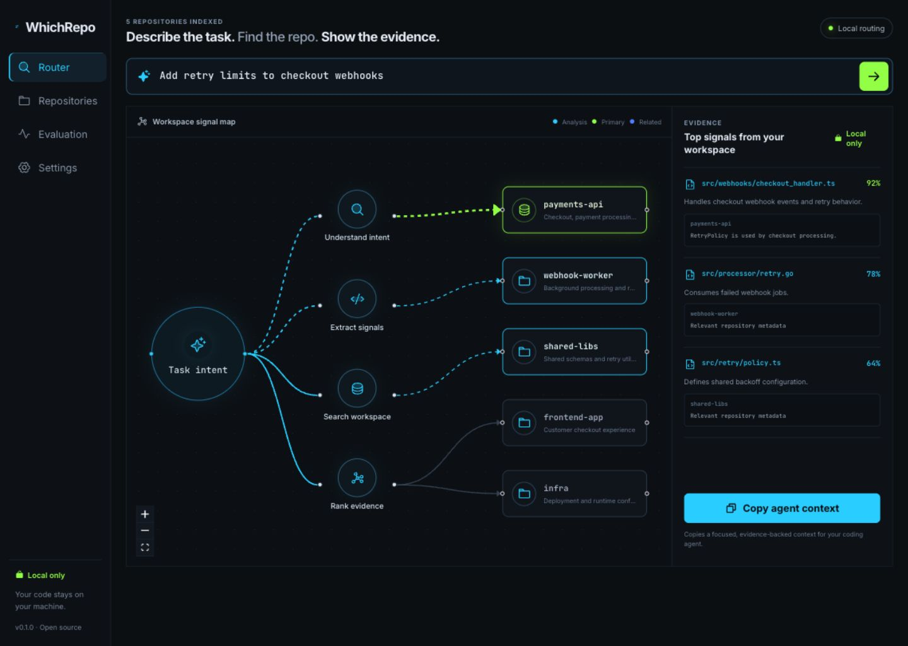

<div align="center">

# WhichRepo

**Describe the task. Find the repo. Show the evidence.**

A local-first task router for multi-repo workspaces, microservices, monorepos, and coding agents.

[Quick start](#quick-start) · [Dashboard](#dashboard) · [MCP](#coding-agent-integration) · [Privacy](#privacy) · [中文](README.zh-CN.md)

</div>



## Why WhichRepo?

Coding agents are good at editing code once they have the right context. In a workspace with dozens of services, the expensive first question is often simpler: **which repository should own this task?**

WhichRepo indexes project metadata locally, retrieves likely repositories, and shows the evidence behind every match. It can also use Jev as an optional decision layer, but the core workflow works without an account, API key, or network request.

## Features

- **Multi-repo and monorepo discovery** — Git repositories plus Go, Node, Python, Rust, Maven, and Gradle manifests.
- **Local-first routing** — SQLite + BM25, with no telemetry and no source upload.
- **Evidence, not guesses** — matched paths, metadata, aliases, and dependency signals.
- **Microservice-aware map** — primary and related repositories with cross-project dependencies.
- **Optional Jev decisions** — Vercel AI Gateway, TypeSafe, or OpenRouter, with automatic local fallback.
- **Agent-native** — MCP tools and a bundled skill for Codex, Claude Code, Cursor, OpenCode, and Gemini CLI.
- **Single binary dashboard** — Router, Workspace Map, project list, evaluation lab, and privacy status on loopback only.

## Quick start

```bash
git clone https://github.com/smallshellctw/whichrepo.git
cd whichrepo
make build
```

After the first release:

```bash
go install github.com/smallshellctw/whichrepo/cmd/whichrepo@latest
```

Initialize and route a task:

```bash
whichrepo init ~/code
cd ~/code
whichrepo "Add retry limits to checkout webhooks"
whichrepo dashboard --open
```

Try the included microservice fixture:

```bash
whichrepo index --workspace ./examples/polyrepo --config ./examples/polyrepo/.whichrepo.yaml --db /tmp/whichrepo-demo.db
whichrepo route --workspace ./examples/polyrepo --config ./examples/polyrepo/.whichrepo.yaml --db /tmp/whichrepo-demo.db "Add retry limits to checkout webhooks"
```

## Dashboard

The embedded Dashboard binds to `127.0.0.1` and includes:

- **Router** — task-to-repository signal map and evidence.
- **Repositories** — languages, descriptions, files, and dependency links.
- **Evaluation** — benchmark format and local accuracy metrics.
- **Settings & Privacy** — provider status and remote payload boundary.

## Configuration

Commit team metadata as `.whichrepo.yaml`:

```yaml
version: 1
workspace:
  name: commerce-platform
  exclude: [archive-*, tmp-*]
projects:
  payments-api:
    path: services/payments-api
    description: Checkout, payments, and webhook endpoints
    aliases: [checkout, payments, webhooks]
```

Put private aliases in `.whichrepo.local.yaml`; keep it untracked.

| Environment variable | Purpose |
| --- | --- |
| `WHICHREPO_WORKSPACE` | Workspace root |
| `WHICHREPO_DB` | SQLite index path |
| `WHICHREPO_CONFIG` | Explicit config path |
| `WHICHREPO_PROVIDER` | `local`, `jev-vercel`, `jev-typesafe`, or `jev-openrouter` |
| `WHICHREPO_PROVIDER_URL` | Override provider endpoint |
| `WHICHREPO_MODEL` | Override provider model |

Provider keys use `AI_GATEWAY_API_KEY`, `TYPESAFE_API_KEY`, or `OPENROUTER_API_KEY`. Never put keys in workspace configuration.

## Coding agent integration

MCP tools: `route_task`, `refresh_index`, `list_projects`, and `workspace_status`.

Codex:

```bash
codex mcp add whichrepo -- whichrepo mcp --workspace /path/to/workspace
```

Claude Code:

```bash
claude mcp add whichrepo --scope user -- whichrepo mcp --workspace /path/to/workspace
```

Client-specific examples live in [`docs/integrations`](docs/integrations/).

## Optional Jev routing

```bash
export WHICHREPO_PROVIDER=jev-vercel
export AI_GATEWAY_API_KEY="..."
whichrepo "Add retry limits to checkout webhooks"
```

Authentication, billing, rate-limit, timeout, and availability failures are classified separately and fall back to local results.

## Evaluation

JSONL case:

```json
{"task":"Add retry limits to checkout webhooks","expected_projects":["payments-api","webhook-worker"]}
```

```bash
whichrepo eval --dataset benchmarks/starter.jsonl
```

## Privacy

- Source files and the SQLite index stay local.
- Known credential files are excluded before indexing.
- Remote decision providers receive only task text, candidate summaries, and redacted evidence.
- No telemetry is collected.
- Routing results are evidence, not authorization to edit, commit, deploy, or access production systems.

See [SECURITY.md](SECURITY.md) for the threat model and reporting policy.

## Development

```bash
make test
make web
make build
```

See [CONTRIBUTING.md](CONTRIBUTING.md) and [ROADMAP.md](ROADMAP.md).

## License

MIT
